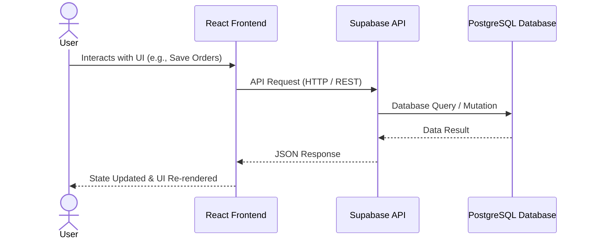
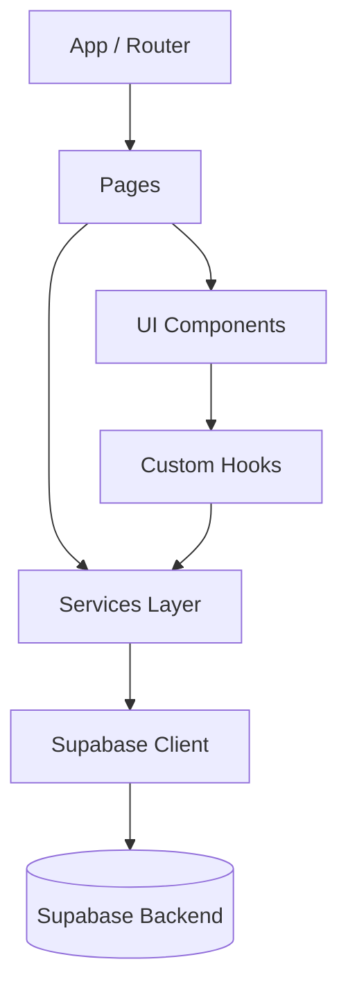
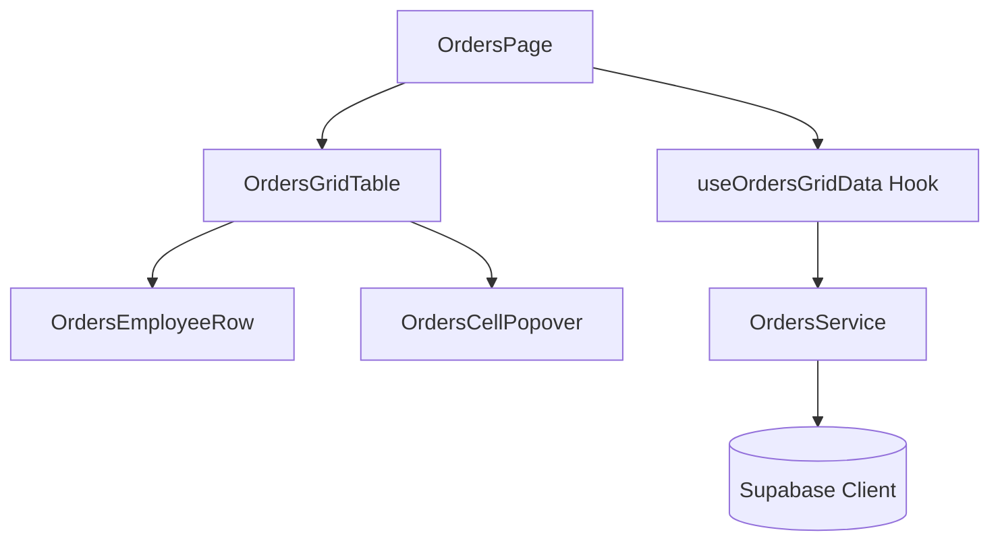
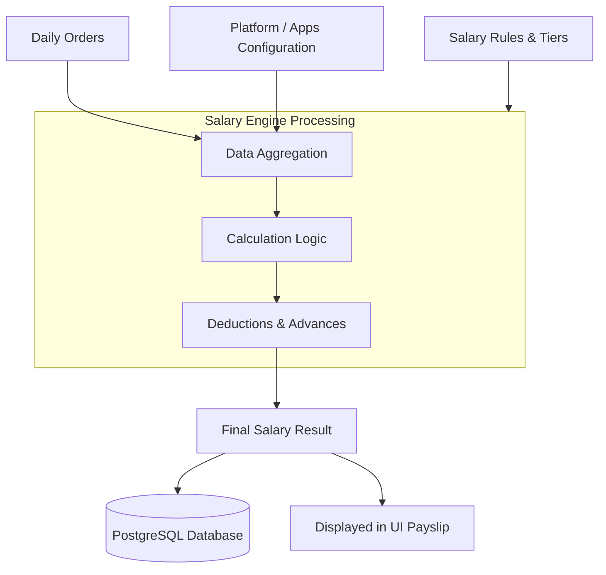

# System Architecture Documentation

This document outlines the high-level architecture, data flows, and module dependencies for the Delivery Driver Management System (Muhimmat Altawseel). The system handles rider management, attendance, daily orders, and automated salary calculations using a modern React frontend and Supabase backend.

## 1. System Architecture Diagram

This diagram illustrates the high-level infrastructure of the system, showing how the frontend interacts with Supabase services, database, and external APIs.

```mermaid
flowchart TD
    User([User / Admin]) --> Frontend
    
    subgraph FrontendApp [Frontend]
        React[React + TypeScript App]
    end
    
    Frontend --> React
    React --> SupaAPI
    React --> SupaAuth
    React --> EdgeFunctions
    
    subgraph SupabaseBackend [Backend (Supabase)]
        SupaAuth[Supabase Auth]
        SupaAPI[Supabase API / PostgREST]
        EdgeFunctions[Edge Functions]
        SalaryEngine[Salary Engine]
        DB[(PostgreSQL Database)]
    end
    
    subgraph External [External Services]
        Groq[Groq Proxy / AI Insights]
    end
    
    SupaAPI --> DB
    SupaAuth --> DB
    EdgeFunctions --> SalaryEngine
    SalaryEngine --> DB
    EdgeFunctions --> Groq
```

---

## 2. Data Flow Diagram

This sequence diagram demonstrates the standard lifecycle of data moving from the user interface down to the database and back.



---

## 3. Module Dependencies

This graph shows the structural dependency chain within the React frontend, illustrating how pages, components, hooks, and services connect.



---

## 4. Feature Module Diagram (Orders Module)

A zoomed-in look at the **Orders Module**, showcasing the relationship between its visual components, state hooks, and API services.



---

## 5. Salary Flow Diagram

This flowchart outlines the critical business logic path for calculating a rider's salary based on daily orders, platform configurations, and salary tiers/rules.


